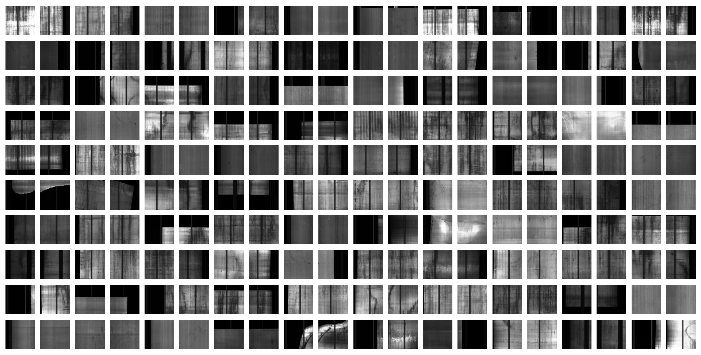
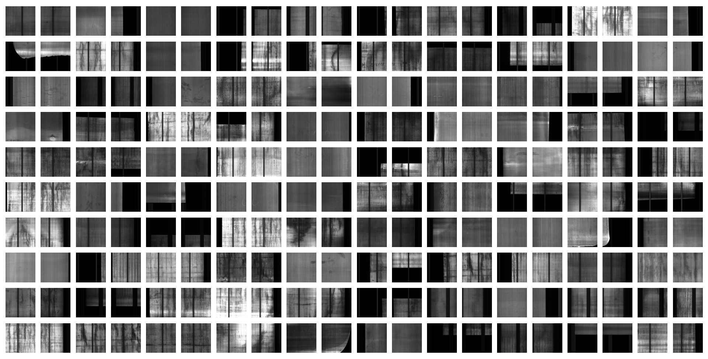
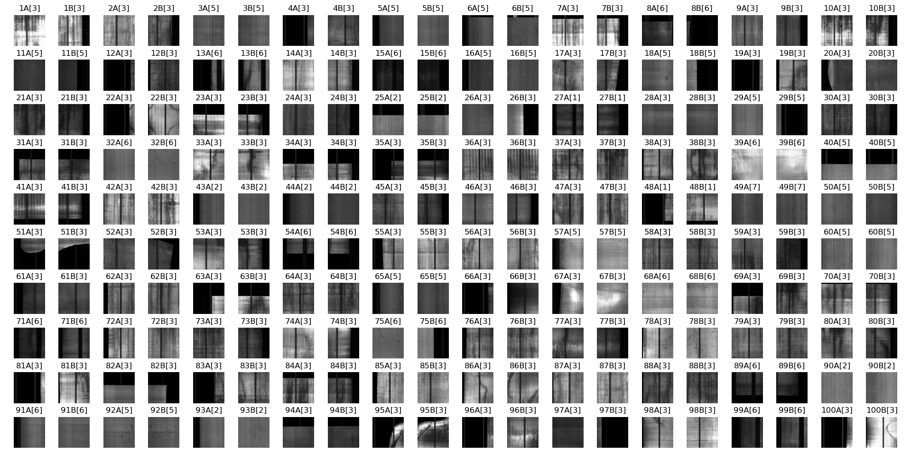
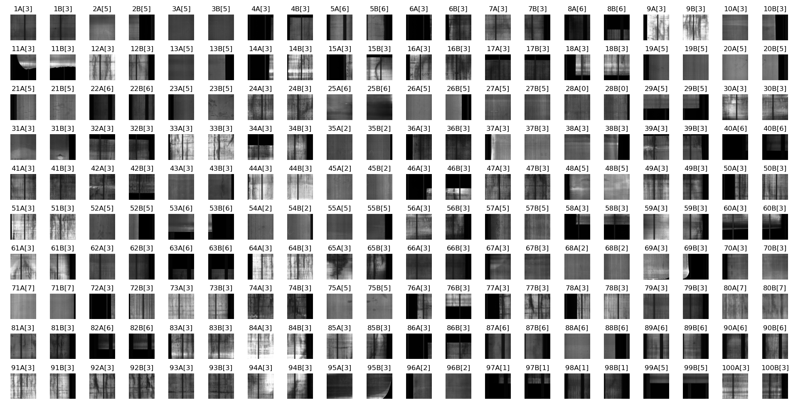

# The NFD Dataset

We gathered and organized data originating from the industrial manufacturing processes of *<u>**N**</u>anjing Iron \& Steel United Co., Ltd.* to create the **NFD** dataset. This dataset is specifically tailored for developing a multi-view inference (MVI) application for metal *<u>**F**</u>law <u>**D**</u>etection*. It consists of 2-view images categorized into 8 types of metal flaws (Horizontal Crack, Scratch, Impurity, Scarring, Indentation, Foreign Matter, Double Skin, and Vertical Crack), totaling 2,100 sets, with 1,677 sets allocated for training and 423 sets for testing.

Examples of images for training:


Examples of images for testing:


## Accessing the data

The whole dataset is stored in the file `NFD.npy`, which is available for download in **Releases**.

To extract the data from the file, code in the following way and we get the dataset in the variable `data`.
```Python
import numpy as np
data = np.load('./NFD.npy', allow_pickle=True)
data = dict(data.item())
```

## The format of the data

The whole dataset is stored in the form of a Python `dict`. The keys and values are listed below.

|Key|Value Type|Description|
|:-:|:-:|:-:|
|'train_images'|`numpy.ndarray(1677, 2, 224, 224, 3)`|The 1,677 2-view images for training|
|'train_labels'|`numpy.ndarray(1677,)`|The 1,677 corresponding labels for 'train_images'|
|'test_images'|`numpy.ndarray(423, 2, 224, 224, 3)`|The 423 2-view images for testing|
|'test_labels'|`numpy.ndarray(423,)`|The 423 corresponding labels for 'test_images'|

### Images

By extracting `img_pair = data['train_images'][i]` or `img_pair = data['test_images'][i]`, we get one pair of 2-view images. Obviously, `img_pair[0]` and `img_pair[1]` are two single-view images, each of which is stored in a `numpy.ndarray(224, 224, 3)` variable, indicating it is a $224 \times 224$ 3-channel grayscale image.

### Labels

Intuitively, `data['train_labels'][i]` is the corresponding label for `data['train_images'][i]`, and `data['test_labels'][i]` is the corresponding label for `data['test_images'][i]`.

The labels are stored as `numpy.int32` variables. They range from $0$ to $7$, representing the 8 types of metal flaws respectively.

### Examples of images with corresponding labels

Here are some examples of images with their corresponding labels. The images are presented in pairs, with "A" and "B" denoting the 2 views. The label for each image is in the brackets after the image number.

For training:


For testing:

